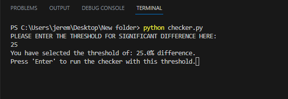
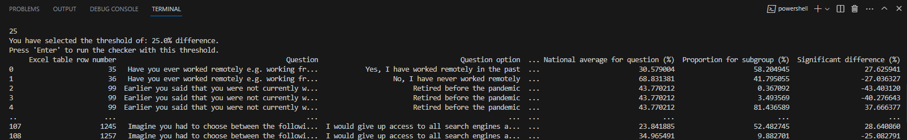

# Percentage Difference Checker

## Introduction
This is a python tool that takes input from the user to specify the threshold for a significant difference from the national average response in Public First's Poll for Google UK. With this user data, the program checks all crossbreaks for all questions and collects responses (that are significantly higher or lower than the national average) and saves them in an excel sheet called output_table.xlsx

The tool is currently a command-line based project which requires a virtual environment such as a code editor to operate. There is, however, scope for this program to be developed into a full-stack, web-hosted application with an interactive front end and polling data stored in a NoSQL database. Currently, this tool requires a small amount of setup to use locally on the user's desktop device.

New users should follow the steps shown in the user manual below to set up an easy-to-use code editor, and to set up Python on their machine.

## Project goals

* To take and store input data from a user.
* To check all crossbreaks against the national average for each question.
* To record each significant difference and output it in a human-readable format.

## User Manual

### Setup for running the program locally.

1. Download the latest version of python and install it on your PC. This can be found [here](https://www.python.org/downloads/).

2. Download and install Visual Studio Code (Microsoft's free code editor). This can be found [here](https://code.visualstudio.com/). Setup instructions can be found [here](https://code.visualstudio.com/docs/setup/windows), although it should be very easy to get up and running. 

3. Once it is installed, open the program. When it loads, select the terminal option from the top toolbar. Click on new terminal. When it loads, type the following command into the terminal and hit 'enter': python --verson
This should return the version of python you just installed on your PC. This is an optional test to make sure python is installed on your PC. For any further issues, please follow this [guide](https://www.youtube.com/watch?v=9o4gDQvVkLU) for setting up Python = VSCode on windows.

4. Create a new folder on your desktop, and place three files inside of it: checker.py, the polling data excel file, and an empty excel file.
5. Make sure the polling data excel file is renamed 'poll_data', or the program will not work.
6. Make sure the empty excel file is renamed 'output_table', or the program will not work.
7. Once your folder is set, right click on the checker.py file and open with Visual Studio Code.
8. Once the editor has loaded, select the file icon in the top left corner of the screen, click on open folder, and select the new folder you created.
9. If there is no terminal at the bottom of the screen select the terminal on the top toolbar and click on new terminal.
10. In the terminal, run the following 2 commands to install the 3rd party dependencies into the code: 
- <strong>pip3 install pandas</strong> (type this into the terminal, press 'Enter', and wait for the package to install before installing the next one. You will know when the installation has finished because the file path for the script's folder will appear in the terminal again.)
- <strong>pip3 install openpyxl</strong>
11. To run the program, type 'python checker.py' into the terminal and hit 'Enter'. If that does not work try the command 'python3 checker.py'. Some more detailed instructions for running python files from a terminal can be found [here](https://learn.microsoft.com/en-us/windows/python/beginners).

### Using the program for the Google UK poll data

1. Run the checker.py file by typing 'python checker.py' in the terminal and hitting 'enter'
    

        
Screenshot

        
    

2. When prompted, type a number (the threshold for significant difference) into the terminal (e.g. 25).
    

        
Screenshot

        
    

3. If you type invalid data here (e.g. anything that is not a number), the program will exit and you will have to start again from step 1 of this section of the manual.
4. You should then get a prompt to tell you that the program will check all data for a 25% difference from the national averages of the poll data.
    

        
Screenshot

        
    

5. Hit 'enter' on your keyboard to run the checking function. There may be a few seconds' wait depending on the amount of data to process.
6. A truncated table of the collated data points that exceed the significant difference threshold (either above or below) will be displayed in the terminal.
    

        
Screenshot

        
    

7. Open the folder where you placed the three files. Open 'output_table.xlsx'
    

        
Screenshot

        
    

8. The data posted to the terminal should also appear here and may now be copied elsewhere for editing.
    

        
Screenshot

        
    

9. OPTIONAL: re-run the program using these steps, but this time enter a different threshold. The output_table.xlsx file should now be re-written with the new set of results.
10. N.B: the output table in the folder on your desktop must always remain where it is in order to work. It is recommended that any result sets you want to save for future use should be copied and saved to a different directory on your PC. If you run the program again before saving the output file, the results will be totally overwritten.
11. If you would like to run the checker on a different poll's results, simply remove the old poll_data.xlsx file from the folder and add a new results excel file (making sure to rename it 'poll_data').

### Output table
The output_table.xlsx file should show seven columns of information:

1. The table row number from the excel file.
2. The question and respondent base.
3. The option within the question that the respondents chose.
4. The crossbreak group (i.e. Wales means respondents who were based in Wales).
5. The percentage of all respondents who chose this option for this question.
6. The percentage of the crossbreak who chose this response for this question.
7. The difference between these two percentages (positive number indicates significantly higher, negative number indicates significantly lower).

### Using the program for future Public First polls

This program is designed to work with the Google polling data provided by Public First, as well as similar excel files which display the same kinds of poll results.

Please note that this script will not work on tables of data that DO NOT display polling results. The excel sheet names 'Full Results' and 'Contents' are hard-coded into the program. If these sheet names are not present in the excel file passed into the program, the script will fail.

## Reporting bugs

If, for any reason, the setup or program does not work as described in the steps already outlined. Please contact the developer at jeremy.h.simons@outlook.com for further assistance in setup/debugging.

## Ideas for future development (beyond the scope of this initial project)

* Use of a library such as Streamlit (Python) to create a frontend dashboard. This would allow the user to input their threshold in a simple webform and for the program to generate a neatly-formatted table of results, rather than operating everything through the terminal.
* Creation of a backend database using Mongo DB where csv versions of the polling data could be stored, retrieved, updated, and deleted for future use.
* Creation of a full-stack system using the two previous ideas mentioned that allows users (likely data team members from Public First) to select the poll project they want to look at and run automated analyses of the data. The advantage of this would be that users would not need to set up python/coding IDEs on their devices to run the tool.

## Credits / 3rd party and opensource code used
Two 3rd party Python libraries were used to develop this project for Public First:
* [Pandas](https://pandas.pydata.org/) for modelling and manipulating the polling data provided by Public First
* [Openpyxl](https://openpyxl.readthedocs.io/en/stable/) for reading and writing to excel files.